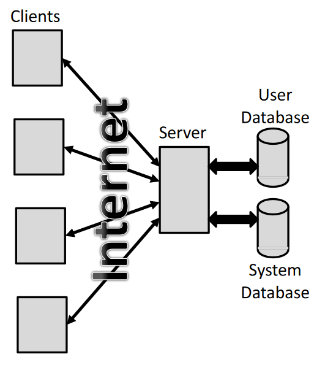

# Final Project for CS 335 
Our goal was to make a server/client architecture that is both general purpose and provides a positive user experience. The program allows for users to sign up to access the server, sign in with their credentials, and retrieve them if anything goes wrong. The program will allow admins to make queries to the program and get information about pre-specified commands. The program is multi-threaded so as to allow multiple users to interact with and be logged into the server at any given time. Most of the contents shown below are based on the contents of our Server/Client Architecture Documentation, which was created in the Fall Semester of 2021. There are no further plans to update this project, all collaborators are mentioned in the Proposal section. Uses Java and SQL.

All the code for the Tetris game in place of the Business logic for the application belongs exclusively to Ben Sottile.

Thank you Ben and David :)
 to full document

## Project Specifications
### General Description from the "Patron"
"I am looking to develop a generic client/server architecture that includes the ability to store information in a database and generate email. The actual application to which this will be applied is not specified at this time."\\

The client is a standalone graphical user interface application to be run on a desktop or laptop computer. User input will be provided utilizing a keyboard and mouse. Server will have an administrative graphical user interface. The server will also run on a desktop or laptop computer (different from the client) and will have a graphical user interface for system monitoring. The server must be able serve multiple clients at any given time.

### Specifications
- User database will hold (at a minimum) login authentication information
	+ Username
	+ Password
	+ Email address

- System database will hold all required application persistent data
	+ To be defined when the business logic is specified (No necessary for this project / Tetris will take the place of it)\

- Graphical user interface (on the client) will allow the following functionality
#### [New user registration]
		+ Username
		+ Password
			* Enforce minimum length
			* Enforce combination of letters/numbers
		+ Email address
		+ Enforce proper form e.g. username@domainname.typ

#### [Login]
		+ Username
		+ Password (protected)
		+ Authenticate
		+ Limit number of attempts to 3
			* After 3 attempts user becomes locked out and must request a new password be emailed to the email address on record (see password recovery below)

#### [Logout]\\

#### [Password recovery]
		+ Username
			* Send password to email address on record

#### [Connect]
		+ User supplies the server IP address
	
#### [Disconnect]
		+ Disconnects the client from the server but leaves the client running
	
#### [Change password]
		+ User is logged in
		+ User supplies a new password (specification above)
		+ User supplies a retype of the password with must match the first for the change to take place

#### [Business Logic]
		+ To be specified at a later date (Not necessary for this project / Once again we're using Tetris, Thanks Ben)
		+ Graphical user interface (on the server)

\

- Graphical user interface (on the server)
	+ Query number of registered users
	+ Query number of logged in users
	+ Query which users are logged in
	+ Query which users are locked out
	+ Query number of connected user 
\
_Disclaimer_**: *The contents in the above section of Project Specifications are taken from Dr. Reinhart's Original Assignment Document*